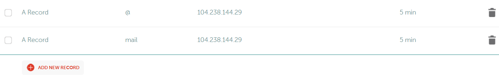
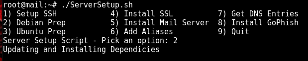
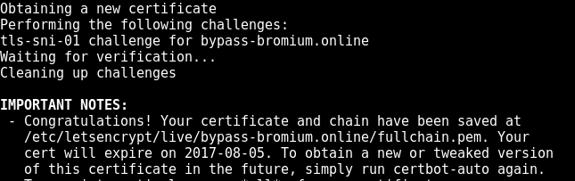
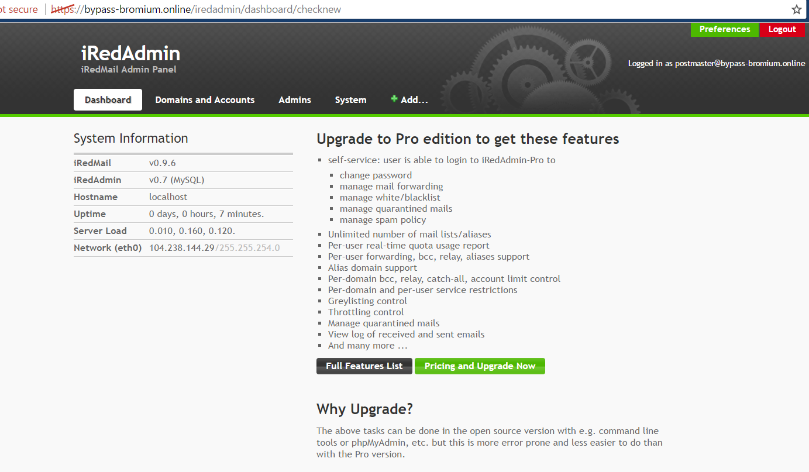
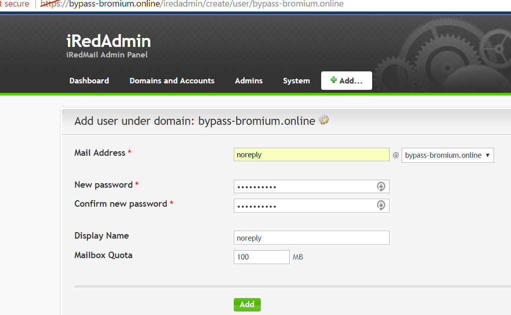
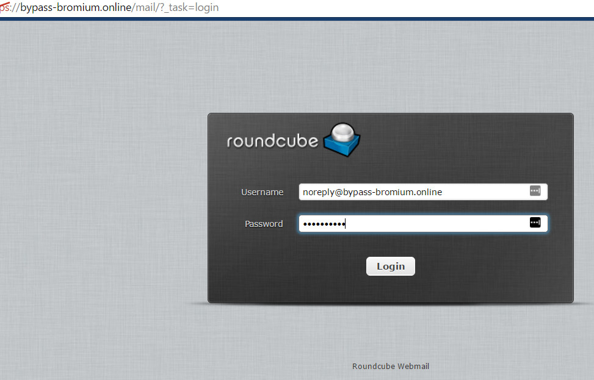
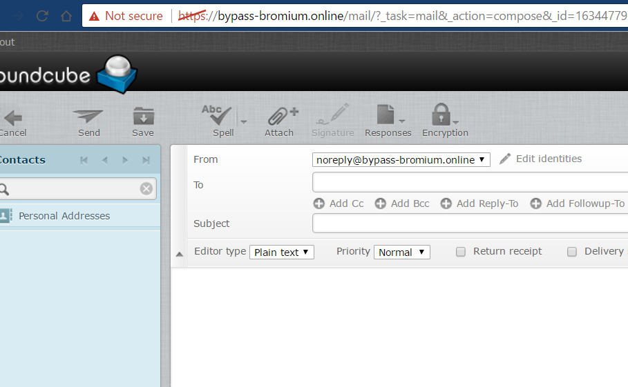
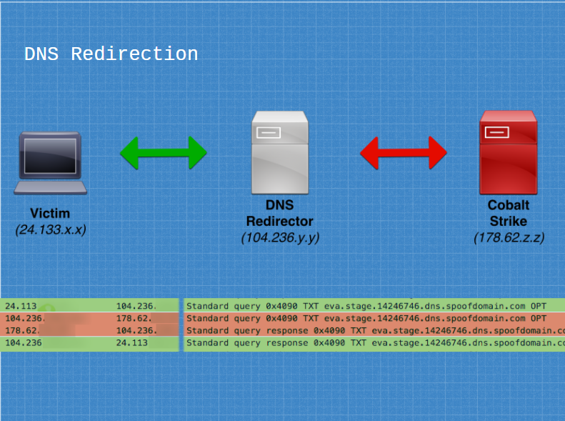
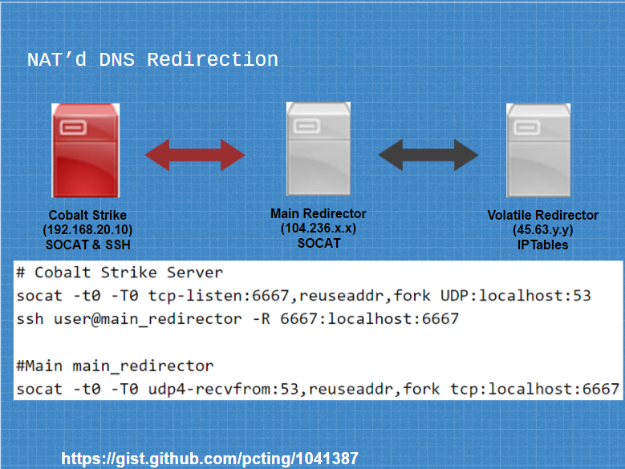

This wiki is intended to provide a resources for setting up a resilient Red Team infrastructure. It was made to complement Steve Borosh ([@424f424f](https://twitter.com/424f424f)) and Jeff Dimmock's ([@bluscreenofjeff](https://twitter.com/bluscreenofjeff)) BSides NoVa 2017 talk "Doomsday Preppers: Fortifying Your Red Team Infrastructure" ([slides](https://speakerdeck.com/rvrsh3ll/doomsday-preppers-fortifying-your-red-team-infrastructure))

If you have an addition you'd like to make, please submit a Pull Request or file an issue on the repo.

THANK YOU to all of the authors of the content referenced in this wiki and to all who [contributed](#thanks-to-contributors)!

# Table of Contents

- [Design Considerations](#design-considerations)
  - [Functional Segregation](#functional-segregation)
  - [Using Redirectors](#using-redirectors)
  - [Sample Design](#sample-design)
  - [Further Resources](#further-resources)
- [Domains](#domains)
  - [Categorization and Blacklist Checking Resources](#categorization-and-blacklist-checking-resources)
- [Phishing](#phishing-setup)
  - [Easy Web-Based Phishing](#easy-web-based-phishing)
  - [Cobalt Strike Phishing](#cobalt-strike-phishing)
  - [Phishing Frameworks](#phishing-frameworks)
- [Redirectors](#redirectors)
  - [SMTP](#smtp)
    - [Sendmail](#sendmail)
      - [Remove previous server headers](#remove-previous-server-headers)
      - [Configure a catch-all address](#configure-a-catch-all-address)
    - [Postfix](#postfix)
  - [DNS](#dns)
    - [socat for DNS](#socat-for-dns)
    - [iptables for DNS](#iptables-for-dns)
  - [HTTP(S)](#https)
    - [socat vs mod_rewrite](#socat-vs-modrewrite)
    - [socat for HTTP](#socat-for-http)
    - [iptables for HTTP](#iptables-for-http)
    - [Payloads and Web Redirection](#payloads-and-web-redirection)
    - [C2 Redirection](#c2-redirection)
      - [C2 Redirection with HTTPS](#c2-redirection-with-https)
    - [Other Apache mod_rewrite Resources](#other-apache-mod_rewrite-resources)
- [Modifying C2 Traffic](#modifying-c2-traffic)
  - [Cobalt Strike](#cobalt-strike)
  - [Empire](#empire)
- [Third-Party C2 Channels](#third-party-c2-channels)
  - [Domain Fronting](#domain-fronting)
    - [Further Resources on Domain Fronting](#further-resources-on-domain-fronting)
  - [PaaS Redirectors](#paas-redirectors)
  - [Other Third-Party C2](#other-third-party-c2)
- [Obscuring Infrastructure](#obscuring-infrastructure)
- [Securing Infrastructure](#securing-infrastructure)
- [Automating Deployments](#automating-deployments)
- [General Tips](#general-tips)
- [Thanks to Contributors](#thanks-to-contributors)

# Design Considerations

## Functional Segregation
When designing a red team infrastructure that needs to stand up to an active response or last for a long-term engagement (weeks, months, years), it’s important to segregate each asset based on function. This provides resilience and agility against the Blue Team when campaign assets start getting detected. For example, if an assessment’s phishing email is identified, the Red Team would only need to create a new SMTP server and payload hosting server, rather than a whole team server setup.

Consider segregating these functions on different assets:
* Phishing SMTP
* Phishing payloads
* Long-term command and control (C2)
* Short-term C2

Each of these functions will likely be required for each social engineering campaign. Since active incident response is typical in a Red Team assessment, a new set of infrastructure should be implemented for each campaign.

## Using Redirectors
To further resilience and concealment, every back-end asset (i.e. team server) should have a redirector placed in front of it. The goal is to always have a host between our target and our backend servers. Setting up the infrastructure in this manner makes rolling fresh infrastructure much quicker and easier - no need to stand up a new team server, migrate sessions, and reconnect non-burned assets on the backend.

Common redirector types:
* SMTP
* Payloads
* Web Traffic
* C2 (HTTP(S), DNS, etc)

Each redirector type has multiple implementation options that best fit different scenarios. These options are discussed in further detail in the [Redirectors](#redirectors) section of the wiki. Redirectors can be VPS hosts, dedicated servers, or even apps running on a Platform-as-a-Service instance.

## Sample Design
Here is a sample design, keeping functional segregation and redirector usage in mind:


## Further Resources

* [A Vision for Distributed Red Team Operations - Raphael Mudge (@armitagehacker)](https://blog.cobaltstrike.com/2013/02/12/a-vision-for-distributed-red-team-operations/)

* [Infrastructure for Ongoing Red Team Operations - Raphael Mudge](https://blog.cobaltstrike.com/2014/09/09/infrastructure-for-ongoing-red-team-operations/)

* [Advanced Threat Tactics (2 of 9): Infrastructure - Raphael Mudge](https://www.youtube.com/watch?v=3gBJOJb8Oi0)

* [Cloud-based Redirectors for Distributed Hacking - Raphael Mudge](https://blog.cobaltstrike.com/2014/01/14/cloud-based-redirectors-for-distributed-hacking/)

* [6 Red Team Infrastructure Tips - Alex Rymdeko-Harvey (@killswitch-gui)](https://cybersyndicates.com/2016/11/top-red-team-tips/)

* [How to Build a C2 Infrastructure with Digital Ocean – Part 1 - Lee Kagan (@invokethreatguy)](https://www.blackhillsinfosec.com/build-c2-infrastructure-digital-ocean-part-1/)

* [Automated Red Team Infrastructure Deployment with Terraform - Part 1 - Rasta Mouse (@_RastaMouse)](https://rastamouse.me/2017/08/automated-red-team-infrastructure-deployment-with-terraform---part-1/)

# Domains
Domain reputation will vary greatly depending on the products your target is using, as well as their configuration. As such, choosing a domain that will work on your target is not an exact science. Open source intelligence gathering (OSINT) will be critical in helping make a best guess at the state of controls and which resources to check domains against. Luckily, online advertisers face the same problems and have created some solutions we can leverage.

[expireddomains.net](http://expireddomains.net) is a search engine for recently expired or dropped domains. It provides search and advanced filtering, such as age of expiration, number of backlinks, number of Archive.org snapshots, [SimilarWeb](https://www.similarweb.com/) score. Using the site, we can register pre-used domains, which will come with domain age, that look similar to our target, look similar to our impersonation, or simply are likely to blend in on our target’s network.


When choosing a domain for C2 or data exfiltration, consider choosing a domain categorized as Finance or Healthcare. Many organizations will not perform SSL middling on those categories due to the possibility of legal or data sensitivity issues.

The tool [CatMyFish](https://github.com/Mr-Un1k0d3r/CatMyFish) by Charles Hamilton([@MrUn1k0d3r](https://twitter.com/mrun1k0d3r)) automates searches and web categorization checking with expireddomains.net and BlueCoat. It can be modified to apply more filters to searches or even perform long term monitoring of assets you register.

Another tool, [DomainHunter](https://github.com/minisllc/domainhunter) by Joe Vest ([@joevest](https://twitter.com/joevest)) & Andrew Chiles ([@andrewchiles](https://twitter.com/andrewchiles)), builds on what CatMyFish did and returns BlueCoat and IBM X-Force categorization, domain age, alternate available TLDs, Archive.org links, and an HTML report. Check out the [blog post](http://threatexpress.com/2017/03/leveraging-expired-domains-for-red-team-engagements/) about the tool's release for more details.

Yet another tool, [AIRMASTER](https://github.com/t94j0/AIRMASTER) by [Max Harley (@Max_68)](https://twitter.com/@Max_68) uses expireddomains.net and Bluecoat to find categorized domains. This tool uses OCR to bypass the Bluecoat captcha, increasing the search speed.

If a previously-registered domain isn't available or you would prefer a self-registered domain, it's possible to categorize domains yourself. Using the direct links below or a tool like [Chameleon](https://github.com/mdsecactivebreach/Chameleon) by Dominic Chell ([@domchell](https://twitter.com/domchell)). Most categorization products will overlook redirects or cloned content when determining the domain's categorization. For more information about Chameleon usage, check out Dominic's post [Categorisation is not a security boundary](https://www.mdsec.co.uk/2017/07/categorisation-is-not-a-security-boundary/).

Finally, make sure your DNS settings have propogated correctly.
* [DNS Propogation Checker](https://dnschecker.org/)

## Categorization and Blacklist Checking Resources
* [McAfee](https://trustedsource.org/en/feedback/url?action=checksingle)
* [Fortiguard](http://www.fortiguard.com/iprep)
* [Symantec + BlueCoat](http://sitereview.bluecoat.com/sitereview.jsp)
* [Checkpoint (requires free account)](https://www.checkpoint.com/urlcat/main.htm)
* [Palo Alto](https://urlfiltering.paloaltonetworks.com/)
* [Sophos (submission only; no checking)](https://secure2.sophos.com/en-us/support/contact-support.aspx) - Click Submit a Sample -> Web Address
* [TrendMicro](https://global.sitesafety.trendmicro.com/)
* [Brightcloud](http://www.brightcloud.com/tools/url-ip-lookup.php)
* [Websense (Forcepoint)](http://csi.websense.com/)
* [Lightspeed Systems](https://archive.lightspeedsystems.com/)
* [Chameleon](https://github.com/mdsecactivebreach/Chameleon)
* [SenderBase](https://www.senderbase.org/)
* [MultiBL](http://multirbl.valli.org/)
* [MXToolBox - Blacklists](https://mxtoolbox.com/blacklists.aspx)

# Phishing Setup

## Easy Web-Based Phishing
The words easy and phishing never really seem to go together. Setting up a proper phishing infrastructure can be a real pain. The following tutorial will provide you with the knowledge and tools to quickly setup a phishing server that passes "most" spam filters to-date and provides you with a RoundCube interface for an easy phishing experience including two-way communications with your target. There are many setup's and posts out there regarding phishing. This is just one method.

Once you have a domain that passes the proper checks listed in the previous section and have your phishing server spun-up, you'll need to create a couple "A" records for your domain as pictured.



Next, ssh into your phishing server and download the following script to setup the first half of your infrastructure. [Postfix-Server-Setup-Script](https://github.com/n0pe-sled/Postfix-Server-Setup)
Set the script to executable such as "chmod +x ServerSetup.sh". Now we can run the setup script and begin the setup by selecting either option to prep your Debian or Ubuntu image, install the proper dependencies, and set the hostname.



The server will reboot. SSH back into the server and run the script again. This time, select option 4 to install a LetsEncrypt cert. Make sure you have your A records set and propogated by now. Follow the prompts and you should be greeted with a message letting you know that the certificates were created sucessfully.



Next, we follow script option 5 to setup the mail server. Again, follow the prompts and you'll be set with a working mail server. Now, you should follow script option 7 to get get the DNS entries that you'll need to add to your DNS records. Tip: the script outputs those entries in the file dnsentries.txt.

You're done, with part 1. Next, you're going to install the web front-end to phish from in just a few easy steps. Start by downloading the latest version of [iRedMail](http://www.iredmail.org/download.html) onto your phishing server. Easy way is to right click the download button, copy the link address, use wget to download directly onto your phishing server. Next, unpack it. You may need to install the bzip2 archiving program. Navigate into the unpacked folder and make the iRedMail.sh script executable (chmod +x iRedMail.sh). Execute the script as root, follow the prompts, and login to your iRedMail server dashboard!



Now, create a user to phish with.



Login to the RoundCube interface with your new user and phish responsibly!





## Cobalt Strike Phishing
Cobalt Strike provides customizable spearphishing functionality to support pentest or red team email phishing. It supports templates in HTML and/or plaintext formats, attachments, a bounceback address, URL embedding, remote SMTP server usage, and per-message send delays. Another interesting feature is the ability to add a unique token to each user's embedded URL for click tracking.


For more detailed information, check out these resources:

* [Cobalt Strike - Spear Phishing documentation](https://www.cobaltstrike.com/help-spear-phish)
* [Cobalt Strike Blog - What's the go-to phishing technique or exploit?](https://blog.cobaltstrike.com/2014/12/17/whats-the-go-to-phishing-technique-or-exploit/)
* [Spear phishing with Cobalt Strike - Raphael Mudge](https://www.youtube.com/watch?v=V7UJjVcq2Ao)
* [Advanced Threat Tactics (3 of 9) - Targeted Attacks - Raphael Mudge](https://www.youtube.com/watch?v=CxQfWtqpwRs)


## Phishing Frameworks

Beyond rolling your own phishing setup or using a pentest or red teaming fraework, like Cobalt Strike, there are numerous tools and frameworks dedicated to email phishing. While this wiki won't go into detail about each framework, a few resources for each are collected below:

### Gophish
* [Gophish Official Site](https://getgophish.com/)
* [Gophish GitHub Repo](https://github.com/gophish/gophish)
* [Gophish User Guide](https://www.gitbook.com/book/gophish/user-guide/details)

### Phishing Frenzy

* [Phishing Frenzy Official Site](https://www.phishingfrenzy.com/)
* [Phishing Frenzy GitHub Repo](https://github.com/pentestgeek/phishing-frenzy)
* [Introducing Phishing Frenzy - Brandon McCann (@zeknox)](https://www.pentestgeek.com/phishing/introducing-phishing-frenzy)

### The Social-Engineer Toolkit
* [The Social-Engineer Toolkit GitHub Repo](https://github.com/trustedsec/social-engineer-toolkit)
* [The Social-Engineer Toolkit User Manual](https://github.com/trustedsec/social-engineer-toolkit/raw/master/readme/User_Manual.pdf)

### FiercePhish (formerly FirePhish)
* [FiercePhish GitHub Repo](https://github.com/Raikia/FiercePhish)
* [FiercePhish Wiki](https://github.com/Raikia/FiercePhish/wiki)

# Redirectors

## SMTP
“Redirector” may not be the best word to describe what we’re going to accomplish, but the goal is the same as with our other redirection. We want to remove any traces of our phishing origination from the final email headers and provide a buffer between the victim and our backend server. Ideally, the SMTP redirector will be quick to setup and easy to decommission.

There are two key actions we want to configure an SMTP redirector to perform:

### Sendmail

#### Remove previous server headers
Add the following line to the end of `/etc/mail/sendmail.mc`:

```bash
define(`confRECEIVED_HEADER',`by $j ($v/$Z)$?r with $r$. id $i; $b')dnl
```

Add to the end of `/etc/mail/access`:

```bash
IP-to-Team-Server *TAB* RELAY
Phish-Domain *TAB* RELAY
```

[Removing Sender’s IP Address From Email’s Received From Header](https://www.devside.net/wamp-server/removing-senders-ip-address-from-emails-received-from-header)

[Removing Headers from Postfix setup](https://major.io/2013/04/14/remove-sensitive-information-from-email-headers-with-postfix/)

#### Configure a catch-all address
This will relay any email received to *@phishdomain.com to a chosen email address. This is highly useful to receive any responses or bounce-backs to a phishing email.

```bash
echo PHISH-DOMAIN >> /etc/mail/local-host-names
```

Add the following line right before `//Mailer Definitions//` (towards the end) of `/etc/mail/sendmail.mc`:

```bash
FEATURE(`virtusertable', `hash -o /etc/mail/virtusertable.db')dnl
```

Add the following line to the end of `/etc/mail/virtusertable`:

```bash
@phishdomain.com  external-relay-address
```

*Note: The two fields should be tab-separated*

### Postfix

Postfix provides an easier alternative to sendmail with wider compatiblity. Postfix also offers full IMAP support with Dovecot. This allows testers to correspond in real-time with phishing targets who respond to the original message, rather than relying on the catch-all address and having to create a new message using your phishing tool.

A full guide to setting up a Postfix mail server for phishing is available in Julian Catrambone's ([@n0pe_sled](https://twitter.com/n0pe_sled)) post [Mail Servers Made Easy](https://blog.inspired-sec.com/archive/2017/02/14/Mail-Server-Setup.html).

## DNS



Note: When using C2 redirectors, a foreign listener should be configured on your post-exploitation framework to send staging traffic through the redirector domain. This will cause the compromised host to stage through the redirector like the C2 traffic itself.

### socat for DNS
socat can be used to redirect incoming DNS packets on port 53 to our team server. While this method works, some user’s have reported staging issues with Cobalt Strike and or latency issues using this method.
Edit 4/21/2017: 
The following socat command seems to work well thanks to testing from @xorrior:
```
socat udp4-recvfrom:53,reuseaddr,fork udp4-sendto:<IPADDRESS>; echo -ne
```

[Redirecting Cobalt Strike DNS Beacons - Steve Borosh](http://www.rvrsh3ll.net/blog/offensive/redirecting-cobalt-strike-dns-beacons/)


### iptables for DNS
iptables DNS forwarding rules have been found to work well with Cobalt Strike. There does not seem to be any of the issues that socat has handling this type of traffic.

An example DNS redirector rule-set is below.

```bash
iptables -I INPUT -p udp -m udp --dport 53 -j ACCEPT
iptables -t nat -A PREROUTING -p udp --dport 53 -j DNAT --to-destination <IP-GOES-HERE>:53
iptables -t nat -A POSTROUTING -j MASQUERADE
iptables -I FORWARD -j ACCEPT
iptables -P FORWARD ACCEPT
sysctl net.ipv4.ip_forward=1
```

Also, change "FORWARD" chain policy to "ACCEPT"

### DNS redirection can also be done behind NAT
Some may have the requirement or need to host a c2 server on an internal network. Using a combination of IPTABLES, SOCAT, and reverse ssh tunnels, we can certainly acheive this in the following manner.



In this scenario we have our volitile redirector using IPTables to forward all DNS traffic using the rule example described earlier in this section. Next, we create an SSH reverse port forward tunnel from our internal c2 server, to our main redirector. This will forward any traffic the main redirector receives on port 6667 to the internal c2 server on port 6667. Now, start socat on our team server to fork any of the incoming TCP traffic on port 6667 to UDP port 53 which, is what our DNS c2 needs to listen on. Finally, we similarly setup a socat instance on the main redirector to redirect any incoming UDP port 53 traffic into our SSH tunnel on port 6667.

## HTTP(S)

Note: When using C2 redirectors, a foreign listener should be configured on your post-exploitation framework to send staging traffic through the redirector domain. This will cause the compromised host to stage through the redirector like the C2 traffic itself.

### socat vs mod_rewrite
socat provides a ‘dumb pipe’ redirection. Any request socat receives on the specified source interface/port is redirected to the destination IP/port. There is no filtering or conditional redirecting. Apache mod_rewrite, on the other hand, provides a number of methods to strengthen your phishing and increase the resilience of your testing infrastructure. mod_rewrite has the ability to perform conditional redirection based on request attributes, such as URI, user agent, query string, operating system, and IP. Apache mod_rewrite uses htaccess files to configure rulesets for how Apache should handle each incoming request. Using these rules, you could, for instance, redirect requests to your server with the default wget user agent to a legitimate page on your target's website.

In short, if your redirector needs to perform conditional redirection or advanced filtering, use Apache mod_rewrite. Otherwise, socat redirection with optional iptables filtering will suffice.

### socat for HTTP

socat can be used to redirect any incoming TCP packets on a specified port to our team server. 

The basic syntax to redirect TCP port 80 on localhost to port 80 on another host is:

```
socat TCP4-LISTEN:80,fork TCP4:<REMOTE-HOST-IP-ADDRESS>:80
```

If your redirector is configured with more than one network interface, socat can be bound to a specific interface, by IP address, with the following syntax:

```
socat TCP4-LISTEN:80,bind=10.0.0.2,fork TCP4:1.2.3.4:80
```
In this example, 10.0.0.2 is one of the redirector's local IP addresses and 1.2.3.4 is the remote team server's IP address.

### iptables for HTTP

In addition to socat, iptables can perform 'dumb pipe' redirection via NAT. To forward the redirector's local port 80 to a remote host, use the following syntax:

```
iptables -I INPUT -p tcp -m tcp --dport 80 -j ACCEPT
iptables -t nat -A PREROUTING -p tcp --dport 80 -j DNAT --to-destination <REMOTE-HOST-IP-ADDRESS>:80
iptables -t nat -A POSTROUTING -j MASQUERADE
iptables -I FORWARD -j ACCEPT
iptables -P FORWARD ACCEPT
sysctl net.ipv4.ip_forward=1
```

### Payloads and Web Redirection

When serving payload and web resources, we want to minimize the ability for incident responders to review files and increase the chances of successfully executing the payload, whether to establish C2 or gather intelligence.


Apache Mod_Rewrite usage and examples by Jeff Dimmock:
* [Strengthen Your Phishing with Apache mod_rewrite](https://bluescreenofjeff.com/2016-03-22-strengthen-your-phishing-with-apache-mod_rewrite-and-mobile-user-redirection/)
* [Invalid URI Redirection with Apache mod_rewrite](https://bluescreenofjeff.com/2016-03-29-invalid-uri-redirection-with-apache-mod_rewrite/)
* [Operating System Based Redirection with Apache mod_rewrite](https://bluescreenofjeff.com/2016-04-05-operating-system-based-redirection-with-apache-mod_rewrite/)
* [Combatting Incident Responders with Apache mod_rewrite](https://bluescreenofjeff.com/2016-04-12-combatting-incident-responders-with-apache-mod_rewrite/)
* [Expire Phishing Links with Apache RewriteMap](https://bluescreenofjeff.com/2016-04-19-expire-phishing-links-with-apache-rewritemap/)
* [Apache mod_rewrite Grab Bag](https://bluescreenofjeff.com/2016-12-23-apache_mod_rewrite_grab_bag/)
* [Serving Random Payloads with Apache mod_rewrite](https://bluescreenofjeff.com/2017-06-13-serving-random-payloads-with-apache-mod_rewrite/)

Other Apache mod_rewrite usage and examples:

* [mod_rewrite rule to evade vendor sandboxes from Jason Lang @curi0usjack](https://gist.github.com/curi0usJack/971385e8334e189d93a6cb4671238b10) 

* [Serving random payloads with NGINX - Gist by jivoi](https://gist.github.com/jivoi/a33ace2e25515a31aa2ffbae246d98c9)

To automatically set up Apache Mod_Rewrite on a redirector server, check out Julain Catrambone's ([@n0pe_sled](https://twitter.com/n0pe_sled)) blog post [Mod_Rewrite Automatic Setup](https://blog.inspired-sec.com/archive/2017/04/17/Mod-Rewrite-Automatic-Setup.html) and the [accompanying tool](https://github.com/n0pe-sled/Apache2-Mod-Rewrite-Setup).

### C2 Redirection

The intention behind redirecting C2 traffic is twofold: obscure the backend team server and appear to be a legitimate website if browsed to by an incident responder. Through the use of Apache mod_rewrite and [customized C2 profiles](#modifying-c2-traffic) or other proxying (such as with Flask), we can reliably filter the real C2 traffic from investigative traffic.

* [Cobalt Strike HTTP C2 Redirectors with Apache mod_rewrite - Jeff Dimmock](https://bluescreenofjeff.com/2016-06-28-cobalt-strike-http-c2-redirectors-with-apache-mod_rewrite/)
* [Securing your Empire C2 with Apache mod_rewrite - Gabriel Mathenge (@_theVIVI)](https://thevivi.net/2017/11/03/securing-your-empire-c2-with-apache-mod_rewrite/)
* [Expand Your Horizon Red Team – Modern SAAS C2 - Alex Rymdeko-Harvey (@killswitch-gui)](https://cybersyndicates.com/2017/04/expand-your-horizon-red-team/)

#### C2 Redirection with HTTPS

Building on "C2 Redirection" above, another method is to have your redirecting server use Apache's SSL Proxy Engine to accept inbound SSL requests, and proxy those to requests to a reverse-HTTPS listener. Encryption is used at all stages, and you can rotate SSL certificates on your redirector as needed.

To make this work with your mod_rewrite rules, you need to place your rules in **"/etc/apache2/sites-available/000-default-le-ssl.conf"** assuming you've used LetsEncrypt (aka CertBot) to install your certificate. Also, to enable the SSL ProxyPass engine, you'll need the following lines in that same config file:

```bash
# Enable the Proxy Engine
SSLProxyEngine On

# Tell the Proxy Engine where to forward your requests
ProxyPass / https://DESTINATION_C2_URL:443/
ProxyPassReverse / https://DESTINATION_C2_URL:443/

# Disable Cert checking, useful if you're using a self-signed cert
SSLProxyCheckPeerCN off
SSLProxyCheckPeerName off
SSLProxyCheckPeerExpire off
```

### Other Apache mod_rewrite Resources
* [mod-rewrite-cheatsheet.com](http://mod-rewrite-cheatsheet.com/)
* [Official Apache 2.4 mod_rewrite Documentation](http://httpd.apache.org/docs/current/rewrite/)
* [Apache mod_rewrite Introduction](https://httpd.apache.org/docs/2.4/en/rewrite/intro.html)
* [An In-Depth Guide to mod_rewrite for Apache](http://code.tutsplus.com/tutorials/an-in-depth-guide-to-mod_rewrite-for-apache--net-6708)
* [Mod_Rewrite/.htaccess Syntax Checker](http://www.htaccesscheck.com/)

# Modifying C2 Traffic

## Cobalt Strike
Cobalt Strike modifies its traffic with Malleable C2 profiles. Profiles provide highly-customizable options for modifying how your server’s C2 traffic will look on the wire. Malleable C2 profiles can be used to strengthen incident response evasion, impersonate known adversaries, or masquerade as legitimate internal applications used by the target.

* [Malleable C2 Profiles - GitHub](https://github.com/rsmudge/Malleable-C2-Profiles)
* [Malleable Command and Control Documentation - cobaltstrike.com](https://www.cobaltstrike.com/help-malleable-c2)
* [Cobalt Strike 2.0 - Malleable Command and Control - Raphael Mudge](http://blog.cobaltstrike.com/2014/07/16/malleable-command-and-control/)
* [Cobalt Strike 3.6 - A Path for Privilege Escalation - Raphael Mudge](http://blog.cobaltstrike.com/2016/12/08/cobalt-strike-3-6-a-path-for-privilege-escalation/)
* [A Brave New World: Malleable C2 - Will Schroeder (@harmj0y)](http://www.harmj0y.net/blog/redteaming/a-brave-new-world-malleable-c2/)
* [How to Write Malleable C2 Profiles for Cobalt Strike - Jeff Dimmock](https://bluescreenofjeff.com/2017-01-24-how-to-write-malleable-c2-profiles-for-cobalt-strike/)


## Empire
Empire uses Communication Profiles, which provide customization options for the GET request URIs, user agent, and headers. The profile consists of each element, separated by the pipe character, and set with the `set DefaultProfile` option in the `listeners` context menu.

Here is a sample default profile:

```bash
"/CWoNaJLBo/VTNeWw11212/|Mozilla/4.0 (compatible; MSIE 6.0;Windows NT 5.1)|Accept:image/gif, image/x-xbitmap, image/jpeg, image/pjpeg, */*|Accept-Language:en-en"
```

Alternatively, the DefaultProfile value can be set by modifying the file `/setup/setup_database.py` before Empire’s initial setup. This will change the default Communication Profile that Empire will use.

In addition to the Communication Profile, consider customizing the Empire server's staging URIs, server headers, and defaut webpage content by following the steps presented in Joe Vest's ([@joevest](https://twitter.com/joevest)) post [Empire - Modifying Server C2 Indicators](http://threatexpress.com/2017/05/empire-modifying-server-c2-indicators/).

* [Default Empire Communication Profiles (in Empire GitHub repo)](https://github.com/EmpireProject/Empire/tree/master/data/profiles)
* [How to Make Communication Profiles for Empire - Jeff Dimmock](https://bluescreenofjeff.com/2017-03-01-how-to-make-communication-profiles-for-empire/)

# Third-Party C2 Channels
Leveraging trusted, legitimate web services for C2 can provide a valuable leg-up over using domains and infrastructure you've configured yourself. Configuration time and complexity varies based on the technique and service being used. A popular example of leveraging third-party services for C2 redirection is Domain Fronting.

## Domain Fronting

Domain Fronting is a technique used by censorship evasion services and apps to route traffic through legitimate and highly-trusted domains. Popular services that support Domain Fronting include [Google App Engine](https://cloud.google.com/appengine/), [Amazon CloudFront](https://aws.amazon.com/cloudfront/), and [Microsoft Azure](https://azure.microsoft.com/). In a nutshell, traffic uses the DNS and SNI name of the trusted service provider, Google is used in the example below. When the traffic is received by the Edge Server (ex: located at gmail.com), the packet is forwarded to the Origin Server (ex: phish.appspot.com) specified in the packet’s Host header. Depending on the service provider, the Origin Server will either directly forward traffic to a specified domain, which we’ll point to our team server, or a proxy app will be required to perform the final hop forwarding.


For more detailed information about how Domain Fronting works, see the whitepaper [Blocking-resistant communication through domain fronting](https://www.bamsoftware.com/papers/fronting/) and the TOR Project’s [meek documentation](https://trac.torproject.org/projects/tor/wiki/doc/meek)

In addition to the standard frontable domains, such as any google.com domain, it's possible to leverage other legitimate domains for fronting. 

For more information about hunting frontable domains, check out:
* [Domain Fronting via Cloudfront Alternate Domains - Vincenty Yiu (@vysecurity)](https://www.mdsec.co.uk/2017/02/domain-fronting-via-cloudfront-alternate-domains/)
* [Finding Domain frontable Azure domains - thoth / Fionnbharr (@a_profligate)](https://theobsidiantower.com/2017/07/24/d0a7cfceedc42bdf3a36f2926bd52863ef28befc.html)
* [Google Groups: Blog post on finding 2000+ Azure domains using Censys](https://groups.google.com/forum/#!topic/traffic-obf/7ygIXCPebwQ)
* [FindFrontableDomains tool - Steve Borosh (@rvrsh3ll)](https://github.com/rvrsh3ll/FindFrontableDomains)

### Further Resources on Domain Fronting
* [Simplifying Domain Fronting - Tim Malcomvetter (@malcomvetter)](https://medium.com/@malcomvetter/simplifying-domain-fronting-8d23dcb694a0)
* [High-reputation Redirectors and Domain Fronting - Raphael Mudge](https://blog.cobaltstrike.com/2017/02/06/high-reputation-redirectors-and-domain-fronting/)
* [Empire Domain Fronting - Chris Ross (@xorrior)](https://www.xorrior.com/Empire-Domain-Fronting/)
* [Escape and Evasion Egressing Restricted Networks - Tom Steele (@_tomsteele) and Chris Patten](https://www.optiv.com/blog/escape-and-evasion-egressing-restricted-networks)
* [Red Team Insights on HTTPS Domain Fronting Google Hosts Using Cobalt Strike](https://www.cyberark.com/threat-research-blog/red-team-insights-https-domain-fronting-google-hosts-using-cobalt-strike/) - [Will Vandevanter and Shay Nahari of CyberArk](https://www.cyberark.com)
* [SSL Domain Fronting 101 - Steve Borosh (@424f424f)](http://www.rvrsh3ll.net/blog/offensive/ssl-domain-fronting-101/)

## PaaS Redirectors
Many PaaS and SaaS providers provide a static subdomain or URL for use with a provisioned instance. If the associated domain is generally highly trusted, the instances could provide extra trust to your C2 infrastructure over a purchased domain and VPS.

To set the redirection up, you will need to identify a service that issues a static subdomain or URL as part of an instance. Then, either the instance will need to be configured with network or application-based redirection. The instance will act as a proxy, similar to the other redirectors discussed on this wiki.

Specific implementation can vary greatly based on the service; however, for an example using Heroku, check out the blog post [Expand Your Horizon Red Team – Modern SaaS C2](https://cybersyndicates.com/2017/04/expand-your-horizon-red-team/) by [Alex Rymdeko-Harvey (@Killswitch_GUI)](https://twitter.com/Killswitch_GUI). 

Another interesting technique that merits further research is the use of overly-permissive Amazon S3 buckets for C2. Check out the post [S3 Buckets for Good and Evil](https://pentestarmoury.com/2017/07/19/s3-buckets-for-good-and-evil/) by [Andrew Luke (@Sw4mp_f0x)](https://twitter.com/Sw4mp_f0x) for more details on how S3 buckets could be used for C2. This technique could be combined with the third-party C2 capabilities of Empire to use the target's legitimate S3 buckets against them.

## Other Third-Party C2
Other third-party services have been used in the wild for C2 in the past. Leveraging third-party websites that allow for the rapid posting or modification of user-generated content can help you evade reputation-based controls, especially if the third-party site is generally trusted.

Check out these resources for other third-party C2 options:
* [A stealthy Python based Windows backdoor that uses Github as a C&C server](http://securityblog.gr/4434/a-stealthy-python-based-windows-backdoor-that-uses-github-as-a-cc-server/) - [maldevel at securityblog.gr](http://securityblog.gr/author/gkarpouzas/)
* [External C2 (Third-Party Command and Control) - Cobalt Strike Documentation](https://www.cobaltstrike.com/help-externalc2)
* [Cobalt Strike over external C2 – beacon home in the most obscure ways](https://outflank.nl/blog/2017/09/17/blogpost-cobalt-strike-over-external-c2-beacon-home-in-the-most-obscure-ways/) - [Mark Bergman at outflank.nl](https://outflank.nl/blog/author/mark/)
* [“Tasking” Office 365 for Cobalt Strike C2](https://labs.mwrinfosecurity.com/blog/tasking-office-365-for-cobalt-strike-c2) - [William Knowles (@william_knows)](https://twitter.com/william_knows)

# Obscuring Infrastructure

Attack infrastructure is often easy to identify, appearing like a shell of a legitimate server. We will need to take additional steps with our infrastructure to increase the likelihood of blending in with real servers amongst either the target organization or services the target may conceivably use.

[Redirectors](#redirectors) can help blend in by [redirecting invalid URIs](https://bluescreenofjeff.com/2016-03-29-invalid-uri-redirection-with-apache-mod_rewrite/), [expiring phishing payload links](https://bluescreenofjeff.com/2016-04-19-expire-phishing-links-with-apache-rewritemap/), or [blocking common incident responder techniques](https://bluescreenofjeff.com/2016-04-12-combatting-incident-responders-with-apache-mod_rewrite/); however, attention should also be paid to the underlying host and its indicators.

For example, in the post [Fall of an Empire](http://securesql.info/hacks/2017/4/5/fall-of-an-empire), John Menerick ([@Lord_SQL](https://twitter.com/Lord_SQL)) covers methods to detect Empire servers on the internet.

To combat these and similar indicators, it's a good idea to [modify C2 traffic patterns](#modifying-c2-traffic), modify server landing pages, restrict open ports, and modify default response headers.

For more details about how to do these and other tactics for multiple attack frameworks, check out these posts:
* [Empire – Modifying Server C2 Indicators](http://threatexpress.com/2017/05/empire-modifying-server-c2-indicators/) - [Andrew Chiles](https://twitter.com/andrewchiles)
* [Hunting Red Team Empire C2 Infrastructure](http://www.chokepoint.net/2017/04/hunting-red-team-empire-c2.html) - [chokepoint.net](http://www.chokepoint.net/)
* [Hunting Red Team Meterpreter C2 Infrastructure](http://www.chokepoint.net/2017/04/hunting-red-team-meterpreter-c2.html) - [chokepoint.net](http://www.chokepoint.net/)


# Securing Infrastructure
Attack infrastructure can be attacked just the same as any other internet-connected host, and it should be considered HIGHLY sensitive due to the data in use and connections into target environments.

In 2016, remote code execution vulnerabilities were disclosed on the most common attack tools:

* [2016 Metasploit RCE Static Key Deserialization](https://github.com/justinsteven/advisories/blob/master/2016_metasploit_rce_static_key_deserialization.md)
* [2017 Metasploit Meterpreter Dir Traversal Bugs](https://github.com/justinsteven/advisories/blob/master/2017_metasploit_meterpreter_dir_traversal_bugs.md)
* [Empire Fails - Will Schroeder](http://www.harmj0y.net/blog/empire/empire-fails/)
* [Cobalt Strike 3.5.1 Important Security Update - Raphael Mudge](http://blog.cobaltstrike.com/2016/10/03/cobalt-strike-3-5-1-important-security-update/)

**iptables** should be used to filter unwanted traffic and restrict traffic between required infrastructure elements. For example, if a Cobalt Strike team server will only serve assets to an Apache redirector, iptables rules should only allow port 80 from the redirector’s source IP. This is especially important for any management interfaces, such as SSH or Cobalt Strike’s default port 50050. Also consider blocking non-target country IPs. As an alternative, consider using hypervisor firewalls provided by your VPS providers. For example, Digital Ocean offers [Cloud Firewalls](https://www.digitalocean.com/community/tutorials/an-introduction-to-digitalocean-cloud-firewalls) that can protect one or multiple droplets.

**chattr** can be used on team servers to prevent cron directories from being modified. Using chattr, you can restrict any user, including root, from modifying a file until the chattr attribute is removed.

**SSH** should be limited to public-key authentication only and configured to use limited-rights users for initial login. For added security, consider adding multi-factor authentication to SSH.

**Update!** No securing list is complete without a reminder to regularly update systems and apply hot-fixes as needed to remediate vulnerabilities.

Of course, this list is not exhaustive of what you can do to secure a team server. Follow common hardening practices on all infrastructure:

* [Red Hat Enterprise Linux 6 Security Guide](https://access.redhat.com/documentation/en-US/Red_Hat_Enterprise_Linux/6/pdf/Security_Guide/Red_Hat_Enterprise_Linux-6-Security_Guide-en-US.pdf)
* [Debian Documentation on Hardening](https://wiki.debian.org/Hardening)
* [Securing Debian Manual](https://www.debian.org/doc/manuals/securing-debian-howto/)
* [20 Linux Server Hardening Security Tips - nixCraft](https://www.cyberciti.biz/tips/linux-security.html)
* [SANS Linux Security Checklists](https://www.sans.org/score/checklists/linux)

# Automating Deployments
The topics covered in this wiki strengthen attack infrastrctures, but generally require a good deal of time to design and implement. Automation can be used to greatly reduce deployment times, allowing you to deploy more complex setups in less time.

Check out these resources about attack infrastructure automation:
* [Automated Red Team Infrastructure Deployment with Terraform - Part 1](https://rastamouse.me/2017/08/automated-red-team-infrastructure-deployment-with-terraform---part-1/) - [@_RastaMouse](https://twitter.com/_RastaMouse)
* [Mod_Rewrite Automatic Setup](https://blog.inspired-sec.com/archive/2017/04/17/Mod-Rewrite-Automatic-Setup.html) - [Julian Catrambone (@n0pe_sled)](https://twitter.com/n0pe_sled)

# General Tips
* **Document everything** - Running a complex Red Team infrastructure means many moving parts. Be sure to document each asset’s function and where its traffic is sent.

* **Split assets among different service providers and regions** - Infrastructure assets should be spread across multiple service providers and geographic regions. Blue Team members may raise monitoring thresholds against providers identified as actively performing an attack and may even outright block a given service provider. Note: keep international privacy laws in mind if sending encrypted or sensitive data across borders.

* **Don't go overboard** - It's easy to get excited about advanced techniques and want to throw the kitchen sink at a target. If you are emulating a specific adversarial threat, only leverage techniques the real threat actor used or techniques within the skillset of the threat actor. If your red team testing will attack the same target long-term, consider starting "easy" and working through the more advanced tradecraft as your assessments go on. Evolving the red team's technique alongside the blue team's will consistenly push the organization forward, whereas hitting the blue team with everything at once may overwhelm the blue team and slow the learning process.

* **Monitor logs** - All logs should be monitored throughout the engagement: SMTP logs, Apache logs, tcpdump on socat redirectors, iptables logs (specific to traffic forwarding or targeted filtering), weblogs, Cobalt Strike/Empire/MSF logs. Forward logs to a central location, such as with [rsyslog](https://bluescreenofjeff.com/2017-08-08-attack-infrastructure-log-aggregation-and-monitoring/), for easier monitoring. Operator terminal data retention may come in handy for going over an historical command useage during an operation. @Killswitch_GUI created an easy-to-use program named lTerm that will log all bash terminal commands to a central location. [Log all terminal output with lTerm](https://github.com/killswitch-GUI/lterm)

* **Implement high-value event alerting** - Configure the attack infrastructure to generate alerts for high-value events, such as new C2 sessions or credential capture hits. One popular way of implementing alerting is via a chat platform's API, such as Slack. Check out the following posts about Slack alerting: [Slack Shell Bot - Russel Van Tuyl (@Ne0nd0g)](https://www.swordshield.com/2016/11/slackshellbot/), [Slack Notifications for Cobalt Strike - Andrew Chiles (@AndrewChiles)](http://threatexpress.com/2016/12/slack-notifications-for-cobalt-strike/), [Slack Bots for Trolls and Work - Jeff Dimmock (@bluscreenfojeff)](http://bluescreenofjeff.com/2017-04-11-slack-bots-for-trolls-and-work/)

* **Fingerprint incident response** - If possible, try to passively or actively fingerprint IR actions before the assessment starts. For example, send a mediocre phishing email to the target (using unrelated infrastructure) and monitor traffic that infrastructure receives. IR team investigations can disclose a good deal of information about how the team operates and what infrastructure they use. If this can be determined ahead of the assessment, it can be filtered or redirected outright.


# Thanks to Contributors
A BIG THANK YOU to all the following people (listed alphabetically) who contributed tools, tips, or links to include in the wiki, and another THANK YOU to anyone who wrote a tool or post referenced in this wiki!

* [@andrewchiles - Andrew Chiles](https://twitter.com/andrewchiles)
* [@armitagehacker - Raphael Mudge](https://twitter.com/armitagehacker)
* [@beyondnegative - Jeremy Johnson](https://twitter.com/beyondnegative)
* [@bspence7337](https://twitter.com/bspence7337)
* [@domchell - Dominic Chell](https://twitter.com/domchell)
* [@jivoi - EK](https://twitter.com/jivoi)
* [@joevest - Joe Vest](https://twitter.com/joevest)
* [@killswitch_gui - Alex Rymdeko-Harvey](https://twitter.com/killswitch_gui)
* [@ne0nd0g - Russel Van Tuyl](https://twitter.com/ne0nd0g)
* [@n0pe_sled - Julian Catrambone](https://twitter.com/n0pe_sled)
* [@_RastaMouse](https://twitter.com/_RastaMouse)
* [@tifkin_ - Lee Christensen](https://twitter.com/tifkin_)
* [@vysecurity - Vincent Yiu](https://twitter.com/vysecurity)
* [@xorrior - Chris Ross](https://twitter.com/xorrior)
