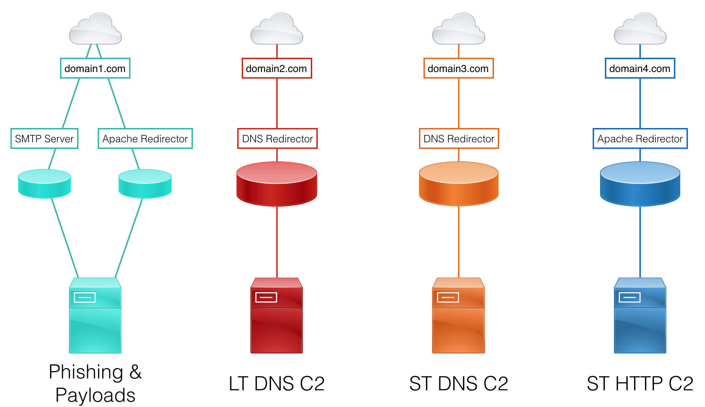
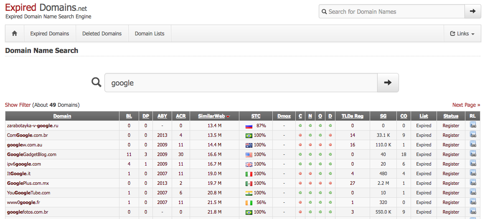
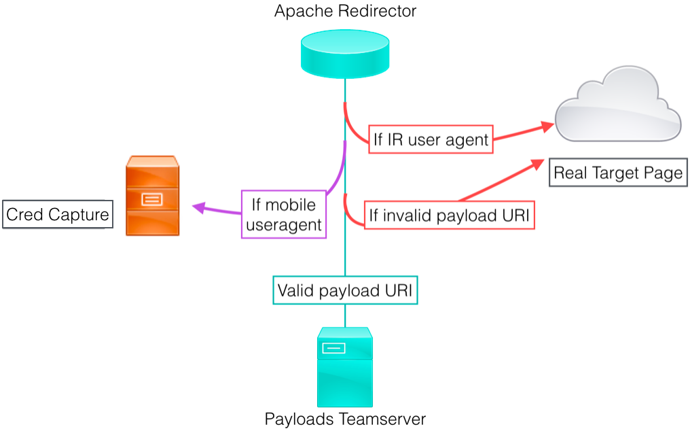
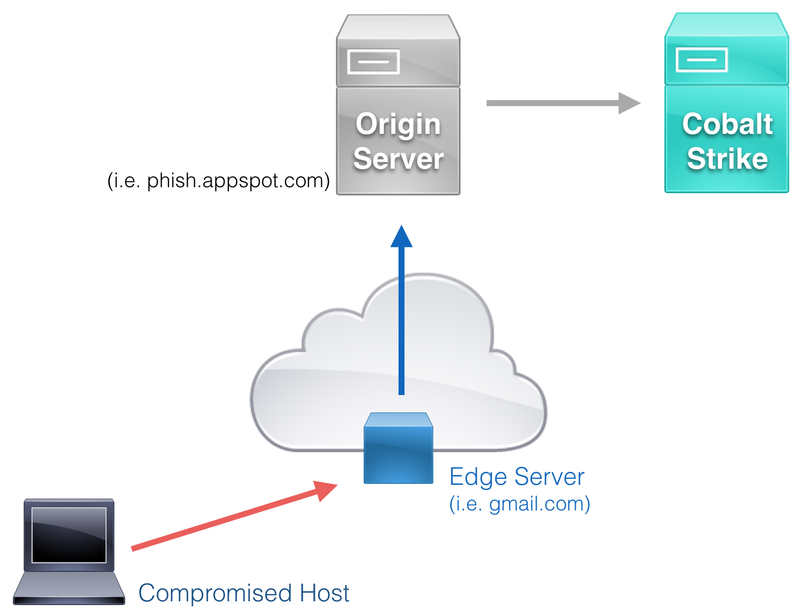

This wiki is intended to provide a resources for setting up a resilient Red Team infrastructure. It was made to complement Steve Borosh ([@424f424f](https://twitter.com/424f424f)) and Jeff Dimmock's ([@bluscreenofjeff](https://twitter.com/bluscreenofjeff)) BSides NoVa 2017 talk "Doomsday Preppers: Fortifying Your Red Team Infrastructure" ([slides](https://speakerdeck.com/rvrsh3ll/doomsday-preppers-fortifying-your-red-team-infrastructure))

If you have an addition you'd like to make, please submit a Pull Request or file an issue on the repo.

THANK YOU to all of the authors of the content linked to in this wiki!

# Table of Contents

- [Design Considerations](#design-considerations)
  - [Functional Segregation](#functional-segregation)
  - [Using Redirectors](#using-redirectors)
  - [Sample Design](#sample-design)
  - [Further Resources](#further-resources)
- [Domains](#domains)
  - [Categorization and Blacklist Checking Resources](#categorization-and-blacklist-checking-resources)
- [Redirectors](#redirectors)
  - [SMTP](#smtp)
    - [Remove previous server headers](#remove-previous-server-headers)
    - [Configure a catch-all address](#configure-a-catch-all-address)
- [DNS](#dns)
  - [socat](#socat)
  - [iptables](#iptables)
- [HTTP(S)](#https)
  - [socat vs mod_rewrite](#socat-vs-mod_rewrite)
  - [Payloads and Web Redirection](#payloads-and-web-redirection)
  - [C2 Redirection](#c2-redirection)
  - [Other Apache mod_rewrite Resources](#other-apache-mod_rewrite-resources)
- [Modifying C2 Traffic](#modifying-c2-traffic)
  - [Cobalt Strike](#cobalt-strike)
  - [Empire](#empire)
- [Domain Fronting](#domain-fronting)
  - [Further Resources](#further-resources)
- [Securing Infrastructure](#securing-infrastructure)
- [General Tips](#general-tips)

# Design Considerations

## Functional Segregation
When designing a red team infrastructure that needs to stand up to an active response or last for a long-term engagement (weeks, months, years), it’s important to segregate each asset based on function. This provides resilience and agility against the Blue Team when campaign assets start getting detected. For example, if an assessment’s phishing email is identified, the Red Team would only need to create a new SMTP server and payload hosting server, rather than a whole teamserver setup.

Consider segregating these functions on different assets:
* Phishing SMTP
* Phishing payloads
* Long-term command and control (C2)
* Short-term C2

Each of these functions will likely be required for each social engineering campaign. Since active incident response is typical in a Red Team assessment, a new set of infrastructure should be implemented for each campaign.

## Using Redirectors
To further resilience and concealment, every back-end asset (i.e. teamserver) should have a redirector placed in front of it. The goal is to always have a host between our target and our backend servers. Setting up the infrastructure in this manner makes rolling fresh infrastructure much quicker and easier - no need to stand up a new teamserver, migrate sessions, and reconnect non-burned assets on the backend.

Common redirector types:
* SMTP
* Payloads
* Web Traffic
* C2 (HTTP(S), DNS, etc)

Each redirector type has multiple implementation options that best fit different scenarios. These options are discussed in further detail in the [Redirectors](#redirectors) section of the wiki. Redirectors can be VPS hosts, dedicated servers, or even apps running on a Platform-as-a-Service instance.

## Sample Design
Here is a sample design, keeping functional segregation and redirector usage in mind:



## Further Resources

* [A Vision for Distributed Red Team Operations - Raphael Mudge (@armitagehacker)](https://blog.cobaltstrike.com/2013/02/12/a-vision-for-distributed-red-team-operations/)

* [Infrastructure for Ongoing Red Team Operations - Raphael Mudge](https://blog.cobaltstrike.com/2014/09/09/infrastructure-for-ongoing-red-team-operations/)

* [Advanced Threat Tactics (2 of 9): Infrastructure - Raphael Mudge](https://www.youtube.com/watch?v=3gBJOJb8Oi0)

* [Cloud-based Redirectors for Distributed Hacking - Raphael Mudge](https://blog.cobaltstrike.com/2014/01/14/cloud-based-redirectors-for-distributed-hacking/)

* [6 Red Team Infrastructure Tips - Alex Rymdeko-Harvey (@killswitch-gui)](https://cybersyndicates.com/2016/11/top-red-team-tips/)

# Domains
Domain reputation will vary greatly depending on the products your target is using, as well as their configuration. As such, choosing a domain that will work on your target is not an exact science. Open source intelligence gathering (OSINT) will be critical in helping make a best guess at the state of controls and which resources to check domains against. Luckily, online advertisers face the same problems and have created some solutions we can leverage.

[expireddomains.net](http://expireddomains.net) is a search engine for recently expired or dropped domains. It provides search and advanced filtering, such as age of expiration, number of backlinks, number of Archive.org snapshots, [SimilarWeb](https://www.similarweb.com/) score. Using the site, we can register pre-used domains, which will come with domain age, that look similar to our target, look similar to our impersonation, or simply are likely to blend in on our target’s network.



When choosing a domain for C2 or data exfiltration, consider choosing a domain categorized as Finance or Healthcare. Many organizations will not perform SSL middling on those categories due to the possibility of legal or data sensitivity issues.

The tool [CatMyFish](https://github.com/Mr-Un1k0d3r/CatMyFish) by Charles Hamilton([@Mr-Un1k0d3r](https://twitter.com/mrun1k0d3r)) automates searches and web categorization checking with expireddomains.net and BlueCoat. It can be modified to apply more filters to searches or even perform long term monitoring of assets you register.

Another tool, [DomainHunter](https://github.com/minisllc/domainhunter) by Joe Vest ([@joevest](https://twitter.com/joevest)) & Andrew Chiles ([@andrewchiles](https://twitter.com/andrewchiles)), builds on what CatMyFish did and returns BlueCoat and IBM X-Force categorization, domain age, alternate available TLDs, Archive.org links, and an HTML report. Check out the [blog post](http://threatexpress.com/2017/03/leveraging-expired-domains-for-red-team-engagements/) about the tool's release for more details.

## Categorization and Blacklist Checking Resources
* [McAfee](https://trustedsource.org/en/feedback/url?action=checksingle)
* [Fortiguard](http://www.fortiguard.com/iprep)
* [Symantec + BlueCoat](http://sitereview.bluecoat.com/sitereview.jsp)
* [SenderBase](https://www.senderbase.org/)
* [MultiBL](http://multirbl.valli.org/)
* [MXToolBox - Blacklists](https://mxtoolbox.com/blacklists.aspx)

# Redirectors

## SMTP
“Redirector” may not be the best word to describe what we’re going to accomplish, but the goal is the same as with our other redirection. We want to remove any traces of our phishing origination from the final email headers and provide a buffer between the victim and our backend server. Ideally, the SMTP redirector will be quick to setup and easy to decommission.

There are two key actions we want to configure an SMTP redirector to perform:

### Remove previous server headers
Add the following line to the end of `/etc/mail/sendmail.mc`:

```bash
define(`confRECEIVED_HEADER',`by $j ($v/$Z)$?r with $r$. id $i; $b')dnl
```

Add to the end of `/etc/mail/access`:

```bash
IP-to-TeamServer *TAB* RELAY
Phish-Domain *TAB* RELAY
```

[Removing Sender’s IP Address From Email’s Received From Header](https://www.devside.net/wamp-server/removing-senders-ip-address-from-emails-received-from-header)

[Removing Headers from Postfix setup](https://major.io/2013/04/14/remove-sensitive-information-from-email-headers-with-postfix/)

### Configure a catch-all address
This will relay any email received to *@phishdomain.com to a chosen email address. This is highly useful to receive any responses or bounce-backs to a phishing email.

```bash
echo PHISH-DOMAIN >> /etc/mail/local-host-names
```

Add the following line right before `//Mailer Definitions//` (towards the end) of `/etc/mail/sendmail.mc`:

```bash
FEATURE(`virtusertable', `hash -o /etc/mail/virtusertable.db')dnl
```

Add the following line to the end of `/etc/mail/virtusertable`:

```bash
@phishdomain.com          external-relay-address
```

*Note: The two fields should be tab-separated*

## DNS

### socat
socat can be used to redirect incoming DNS packets on port 53 to our teamserver. While this method works, some user’s have reported staging issues with Cobalt Strike and or latency issues using this method.
Edit 4/21/2017: 
The following socat command seems to work well thanks to testing from @xorrior:
```
socat udp4-recvfrom:53,reuseaddr,fork udp4-sendto:<IPADDRESS>; echo -ne
```

[Redirecting Cobalt Strike DNS Beacons - Steve Borosh](http://www.rvrsh3ll.net/blog/offensive/redirecting-cobalt-strike-dns-beacons/)


### iptables
iptables DNS forwarding rules have been found to work well with Cobalt Strike. There does not seem to be any of the issues that socat has handling this type of traffic.

An example DNS redirector rule-set is below.

```bash
iptables -I INPUT -p udp -m udp --dport 53 -j ACCEPT
iptables -t nat -A PREROUTING -p udp --dport 53 -j DNAT --to-destination ip:53
iptables -t nat -A POSTROUTING -j MASQUERADE
sysctl net.ipv4.ip_forward=1
```

Also, change "FORWARD" chain policy to "ACCEPT"

## HTTP(S)

### socat vs mod_rewrite
socat provides a ‘dumb pipe’ redirection. Any request socat receives on the specified source interface/port is redirected to the destination IP/port. There is no filtering or conditional redirecting. Apache mod_rewrite, on the other hand, provides a number of methods to strengthen your phishing and increase the resilience of your testing infrastructure. mod_rewrite has the ability to perform conditional redirection based on request attributes, such as URI, user agent, query string, operating system, and IP. Apache mod_rewrite uses htaccess files to configure rulesets for how Apache should handle each incoming request. Using these rules, you could, for instance, redirect requests to your server with the default wget user agent to a legitimate page on your target's website.
In short, if your redirector needs to perform conditional redirection or advanced filtering, use Apache mod_rewrite. Otherwise, socat redirection with optional iptables filtering will suffice.

### Payloads and Web Redirection

When serving payload and web resources, we want to minimize the ability for incident responders to review files and increase the chances of successfully executing the payload, whether to establish C2 or gather intelligence.



* [Strengthen Your Phishing with Apache mod_rewrite - Jeff Dimmock](https://bluescreenofjeff.com/2016-03-22-strengthen-your-phishing-with-apache-mod_rewrite-and-mobile-user-redirection/)
* [Invalid URI Redirection with Apache mod_rewrite - Jeff Dimmock](https://bluescreenofjeff.com/2016-03-29-invalid-uri-redirection-with-apache-mod_rewrite/)
* [Operating System Based Redirection with Apache mod_rewrite - Jeff Dimmock ](https://bluescreenofjeff.com/2016-04-05-operating-system-based-redirection-with-apache-mod_rewrite/)
* [Combatting Incident Responders with Apache mod_rewrite - Jeff Dimmock](https://bluescreenofjeff.com/2016-04-12-combatting-incident-responders-with-apache-mod_rewrite/)
* [Expire Phishing Links with Apache RewriteMap - Jeff Dimmock ](https://bluescreenofjeff.com/2016-04-19-expire-phishing-links-with-apache-rewritemap/)
* [Apache mod_rewrite Grab Bag - Jeff Dimmock](https://bluescreenofjeff.com/2016-12-23-apache_mod_rewrite_grab_bag/)

### C2 Redirection

The intention behind redirecting C2 traffic is twofold: obscure the backend teamserver and appear to be a legitimate website if browsed to by an incident responder. Through the use of Apache mod_rewrite and [customized C2 profiles](#modifying-c2-traffic), we can reliably filter the real C2 traffic from investigative traffic.

* [Cobalt Strike HTTP C2 Redirectors with Apache mod_rewrite - Jeff Dimmock](https://bluescreenofjeff.com/2016-06-28-cobalt-strike-http-c2-redirectors-with-apache-mod_rewrite/)

### Other Apache mod_rewrite Resources
* [mod-rewrite-cheatsheet.com](http://mod-rewrite-cheatsheet.com/)
* [Official Apache 2.4 mod_rewrite Documentation](http://httpd.apache.org/docs/current/rewrite/)
* [Apache mod_rewrite Introduction](https://httpd.apache.org/docs/2.4/en/rewrite/intro.html)
* [An In-Depth Guide to mod_rewrite for Apache](http://code.tutsplus.com/tutorials/an-in-depth-guide-to-mod_rewrite-for-apache--net-6708)
* [Mod_Rewrite/.htaccess Syntax Checker](http://www.htaccesscheck.com/)

# Modifying C2 Traffic

## Cobalt Strike
Cobalt Strike modifies its traffic with Malleable C2 profiles. Profiles provide highly-customizable options for modifying how your server’s C2 traffic will look on the wire. Malleable C2 profiles can be used to strengthen incident response evasion, impersonate known adversaries, or masquerade as legitimate internal applications used by the target.

* [Malleable C2 Profiles - GitHub](https://github.com/rsmudge/Malleable-C2-Profiles)
* [Malleable Command and Control Documentation - cobaltstrike.com](https://www.cobaltstrike.com/help-malleable-c2)
* [Cobalt Strike 2.0 - Malleable Command and Control - Raphael Mudge](http://blog.cobaltstrike.com/2014/07/16/malleable-command-and-control/)
* [Cobalt Strike 3.6 - A Path for Privilege Escalation - Raphael Mudge](http://blog.cobaltstrike.com/2016/12/08/cobalt-strike-3-6-a-path-for-privilege-escalation/)
* [A Brave New World: Malleable C2 - Will Schroeder (@harmj0y)](http://www.harmj0y.net/blog/redteaming/a-brave-new-world-malleable-c2/)
* [How to Write Malleable C2 Profiles for Cobalt Strike - Jeff Dimmock](https://bluescreenofjeff.com/2017-01-24-how-to-write-malleable-c2-profiles-for-cobalt-strike/)


## Empire
Empire uses Communication Profiles, which provide customization options for the GET request URIs, user agent, and headers. The profile consists of each element, separated by the pipe character, and set with the `set DefaultProfile` option in the `listeners` context menu.

Here is a sample default profile:

```bash
"/CWoNaJLBo/VTNeWw11212/|Mozilla/4.0 (compatible; MSIE 6.0;Windows NT 5.1)|Accept:image/gif, image/x-xbitmap, image/jpeg, image/pjpeg, */*|Accept-Language:en-en"
```

Alternatively, the DefaultProfile value can be set by modifying the file `/setup/setup_database.py` before Empire’s initial setup. This will change the default Communication Profile that Empire will use.

* [Default Empire Communication Profiles (in Empire GitHub repo)](https://github.com/EmpireProject/Empire/tree/master/data/profiles)
* [How to Make Communication Profiles for Empire - Jeff Dimmock](https://bluescreenofjeff.com/2017-03-01-how-to-make-communication-profiles-for-empire/)

# Domain Fronting

Domain Fronting is a technique used by censorship evasion services and apps to route traffic through legitimate and highly-trusted domains. Popular services that support Domain Fronting include [Google App Engine](https://cloud.google.com/appengine/), [Amazon CloudFront](https://aws.amazon.com/cloudfront/), and [Microsoft Azure](https://azure.microsoft.com/). In a nutshell, traffic uses the DNS and SNI name of the trusted service provider, Google is used in the example below. When the traffic is received by the Edge Server (ex: located at gmail.com), the packet is forwarded to the Origin Server (ex: phish.appspot.com) specified in the packet’s Host header. Depending on the service provider, the Origin Server will either directly forward traffic to a specified domain, which we’ll point to our teamserver, or a proxy app will be required to perform the final hop forwarding.



For more detailed information about how Domain Fronting works, see the whitepaper [Blocking-resistant communication through domain fronting](https://www.bamsoftware.com/papers/fronting/) and the TOR Project’s [meek documentation](https://trac.torproject.org/projects/tor/wiki/doc/meek)

## Further Resources
* [High-reputation Redirectors and Domain Fronting - Raphael Mudge](https://blog.cobaltstrike.com/2017/02/06/high-reputation-redirectors-and-domain-fronting/)
* [Empire Domain Fronting Chris Ross (@xorrior)](https://www.xorrior.com/Empire-Domain-Fronting/)
* [Domain Fronting via Cloudfront Alternate Domains - Vincenty Yiu (@vysecurity)](https://www.mdsec.co.uk/2017/02/domain-fronting-via-cloudfront-alternate-domains/)
* [Escape and Evasion Egressing Restricted Networks - Tom Steele (@_tomsteele) and Chris Patten](https://www.optiv.com/blog/escape-and-evasion-egressing-restricted-networks)


# Securing Infrastructure
Attack infrastructure can be attacked just the same as any other internet-connected host, and it should be considered HIGHLY sensitive due to the data in use and connections into target environments.

In 2016, remote code execution vulnerabilities were disclosed on the most common attack tools:

* [2016 Metasploit RCE Static Key Deserialization](https://github.com/justinsteven/advisories/blob/master/2016_metasploit_rce_static_key_deserialization.md)
* [2017 Metasploit Meterpreter Dir Traversal Bugs](https://github.com/justinsteven/advisories/blob/master/2017_metasploit_meterpreter_dir_traversal_bugs.md)
* [Empire Fails - Will Schroeder](http://www.harmj0y.net/blog/empire/empire-fails/)
* [Cobalt Strike 3.5.1 Important Security Update - Raphael Mudge](http://blog.cobaltstrike.com/2016/10/03/cobalt-strike-3-5-1-important-security-update/)

**iptables** should be used to filter unwanted traffic and restrict traffic between required infrastructure elements. For example, if a Cobalt Strike teamserver will only serve assets to an Apache redirector, iptables rules should only allow port 80 from the redirector’s source IP. This is especially important for any management interfaces, such as SSH or Cobalt Strike’s default port 50050. Also consider blocking non-target country IPs.

**chattr** can be used on teamservers to prevent cron directories from being modified. Using chattr, you can restrict any user, including root, from modifying a file until the chattr attribute is removed.

**SSH** should be limited to public-key authentication only and configured to use limited-rights users for initial login. For added security, consider adding multi-factor authentication to SSH.

**Update!** No securing list is complete without a reminder to regularly update systems and apply hot-fixes as needed to remediate vulnerabilities.

Of course, this list is not exhaustive of what you can do to secure a teamserver. Follow common hardening practices on all infrastructure:

* [Red Hat Enterprise Linux 6 Security Guide](https://access.redhat.com/documentation/en-US/Red_Hat_Enterprise_Linux/6/pdf/Security_Guide/Red_Hat_Enterprise_Linux-6-Security_Guide-en-US.pdf)
* [Debian Documentation on Hardening](https://wiki.debian.org/Hardening)
* [Securing Debian Manual](https://www.debian.org/doc/manuals/securing-debian-howto/)
* [20 Linux Server Hardening Security Tips - nixCraft](https://www.cyberciti.biz/tips/linux-security.html)
* [SANS Linux Security Checklists](https://www.sans.org/score/checklists/linux)


# General Tips
* **Document everything** - Running a complex Red Team infrastructure means many moving parts. Be sure to document each asset’s function and where its traffic is sent.

* **Split assets among different service providers and regions** - Infrastructure assets should be spread across multiple service providers and geographic regions. Blue Team members may raise monitoring thresholds against providers identified as actively performing an attack and may even outright block a given service provider. Note: keep international privacy laws in mind if sending encrypted or sensitive data across borders.

* **Monitor logs** - All logs should be monitored throughout the engagement: SMTP logs, Apache logs, tcpdump on socat redirectors, iptables logs (specific to traffic forwarding or targeted filtering), weblogs, Cobalt Strike/Empire/MSF logs. Forward logs to a central location, such as with rsyslog, for easier monitoring.

* **Fingerprint incident response** - If possible, try to passively or actively fingerprint IR actions before the assessment starts. For example, send a mediocre phishing email to the target (using unrelated infrastructure) and monitor traffic that infrastructure receives. IR team investigations can disclose a good deal of information about how the team operates and what infrastructure they use. If this can be determined ahead of the assessment, it can be filtered or redirected outright.
